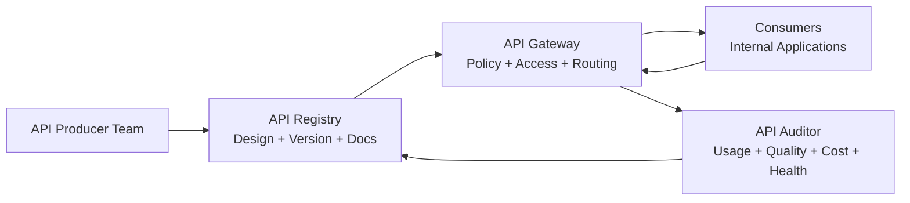

## **Scalable API Governance for Modern Engineering Organizations**

Steve Sparks
 November 2025

---

#### **Why This Matters**

For technology executives navigating the complexities of modern software organizations, API governance represents a critical but often overlooked leverage point for transforming engineering effectiveness. While it may seem like a technical concern best left to architecture teams, the business impact of how your organization manages its internal APIs directly affects four key executive priorities: **reuse, velocity, auditability, and cost**.

**Reuse: Eliminating Redundant Engineering Effort**

In most organizations with hundreds of microservices, teams unknowingly rebuild the same capabilities repeatedly because they cannot discover what already exists. Address validation, payment processing, customer lookup, notification services — these foundational capabilities are implemented dozens of times in parallel by different teams solving identical problems. This redundancy represents pure waste: engineering hours spent recreating solutions instead of building new value, plus the ongoing cost of maintaining multiple versions of functionally identical code. A well-governed API ecosystem makes existing capabilities discoverable and trustworthy, fundamentally changing the default behavior from "build it ourselves" to "find and reuse what exists." Organizations that achieve high reuse rates report 30-40% reductions in duplicative work, freeing substantial engineering capacity for strategic initiatives rather than reinventing solved problems.

**Velocity: Accelerating Time-to-Market**

Engineering velocity collapses when developers spend more time integrating with inconsistent internal services than building features customers care about. Each new integration becomes a research project: hunting down documentation (if it exists), deciphering unique authentication schemes, learning API-specific error handling patterns, and navigating unclear ownership to get questions answered. These integration costs compound exponentially as service counts grow. Standardized, well-documented APIs with clear ownership transform this dynamic completely. When every API follows consistent design patterns, uses the same authentication mechanisms, and provides excellent documentation, integration time drops from weeks to days. Teams can confidently build on internal platforms knowing they're working with reliable, supported products rather than fragile, undocumented dependencies. This shift directly translates to faster feature delivery, shorter time-to-market, and greater competitive agility.

**Auditability: Understanding Dependencies and Managing Risk**

As organizations scale their microservices architectures, they often lose visibility into a critical question: who depends on what? When a security vulnerability emerges in a particular API, how quickly can you identify every affected consumer? When planning to deprecate an outdated service, do you know which applications will break? When a production incident occurs, can you rapidly assess blast radius and notify impacted teams? Without robust API governance, these questions require detective work — searching through logs, querying multiple monitoring systems, and hoping your findings are complete. This opacity creates both operational risk (slow incident response, unexpected breakages) and compliance risk (inability to demonstrate data lineage, access controls, or audit trails). A governed API ecosystem provides complete visibility into consumer relationships, usage patterns, and dependency graphs. This auditability enables confident decision-making: you can evolve your architecture, respond to incidents, and satisfy compliance requirements based on facts rather than guesswork.

**Cost: Reducing Infrastructure Waste and Maintenance Burden**

Ungoverned API proliferation creates hidden costs that accumulate over time. Redundant implementations mean paying for redundant infrastructure — multiple caches, databases, compute instances, and storage systems supporting functionally identical services. Version sprawl without disciplined deprecation means maintaining old APIs indefinitely, consuming resources and engineering attention that should be directed elsewhere. Poorly designed APIs generate excessive traffic through inefficient access patterns, driving up infrastructure costs unnecessarily. Lack of standardization means every API requires unique monitoring, alerting, and support processes, preventing economies of scale. Organizations with mature API governance can systematically address these cost drivers: consolidate redundant services, safely retire obsolete versions, optimize high-traffic patterns, and standardize operational practices. The infrastructure savings alone often justify the governance investment, but the real value comes from redirecting maintenance effort toward innovation. When you're not maintaining dozens of variations of the same capability, your best engineers can focus on solving new problems instead of supporting old ones.

**The Compounding Effect**

These four dimensions reinforce each other. Better reuse accelerates velocity by reducing integration work. Improved auditability enables safer evolution, which supports velocity. Lower costs from consolidation free budget for strategic investments. Organizations that treat internal APIs as products — with clear ownership, lifecycle discipline, and developer experience focus — create a virtuous cycle where each improvement makes the next one easier. Conversely, organizations that neglect API governance experience a vicious cycle where proliferation begets complexity, complexity slows velocity, reduced velocity encourages workarounds, and workarounds further degrade governance. The gap between well-governed and ungoverned API ecosystems widens exponentially over time.

**The Path Forward**

The good news: establishing effective API governance doesn't require a disruptive transformation or massive technology investment. It requires commitment to treating internal APIs as products deserving the same care as customer-facing services, implementing lightweight processes that guide without obstructing, and building a unified platform that makes governance feel like enablement rather than bureaucracy. The organizations making this shift now are seeing 20-30% improvements in engineering productivity, 40-50% reductions in duplicative efforts, and measurably better incident response times. More importantly, they're building the foundation for sustained innovation velocity as their architectures continue to grow and evolve. This isn't a technical initiative — it's a strategic investment in your organization's ability to deliver value efficiently and adapt quickly to changing business needs.

---

--- 

### **Overview**

Internal APIs now power nearly every business capability in modern digital enterprises. But while external APIs are treated as products with roadmaps, documentation, and customer experience in mind, internal APIs are often created as implementation details — poorly documented, inconsistently designed, and rarely governed. This paper proposes a modern, product-centric approach to internal API governance that improves developer experience, accelerates delivery, and reduces duplicative effort. It describes a lightweight, scalable model suitable for organizations with hundreds or thousands of internal microservices.

---

### **The Current Internal API Problem**

APIs often emerge as byproducts of project work rather than deliberate products. Over time, this leads to:

* **Reinvented capabilities** because teams can't find existing APIs — When developers can't easily discover what already exists, they default to building from scratch. This creates parallel implementations of identical functionality across the organization, wasting engineering effort and creating unnecessary technical debt. Without a centralized, searchable catalog of internal APIs, teams operate in silos, unknowingly duplicating work that's already been solved elsewhere in the company.

* **Inconsistent patterns** that increase cognitive load for developers — Each team invents its own approach to authentication, error handling, pagination, versioning, and data formatting. This forces developers to learn different patterns for every API they integrate with, dramatically slowing down development velocity. What should be transferable knowledge becomes API-specific tribal knowledge, making it harder to onboard new engineers and reducing overall organizational efficiency.

* **Version sprawl** and confusion over what's compatible or safe to use — Without disciplined versioning practices, APIs multiply into confusing variants: v1, v2, v1.1, v2-beta, v2-internal, and so on. Developers struggle to determine which version they should use, which are deprecated, and what migration paths exist. This uncertainty leads to teams either sticking with outdated versions or accidentally adopting experimental ones, both of which create technical risk and maintenance burden.

* **Unclear ownership** for support, questions, and breaking changes — When APIs lack explicit owners, no one is accountable for answering questions, fixing bugs, or communicating changes. Developers waste time hunting down the right person to contact, often resorting to searching commit logs or Slack channels. When breaking changes do occur, there's no structured way to notify affected teams, leading to production incidents and emergency fixes that could have been prevented with clear ownership and communication channels.

* **Difficult deprecation** because no one knows who is still using what — Retiring outdated APIs becomes nearly impossible when there's no visibility into consumer relationships. Teams are forced to either leave obsolete APIs running indefinitely (accumulating maintenance costs and security risks) or make risky decisions to sunset them without understanding the impact. Without usage tracking and consumer registries, deprecation planning is guesswork, making it difficult to evolve the architecture or eliminate technical debt safely.

These problems compound at scale. Organizations with 300+ APIs typically see entropy outpace governance unless they adopt a platform-based operating model.

---

### **Why "API as Product" Is the Required Mindset Shift**

Treating internal APIs as products transforms them from artifacts into **owned, curated, discoverable, and reliable services** that developers trust and want to use. This fundamental shift moves APIs from being afterthoughts — created hastily to meet immediate project needs and then abandoned — to being deliberately designed and maintained assets with clear business value. 

Just as external-facing products receive investment in user experience, documentation, support channels, and continuous improvement, internal APIs deserve the same level of care and attention. When APIs are treated as products, they gain dedicated ownership, thoughtful roadmaps, and a commitment to quality that makes them dependable building blocks rather than fragile dependencies. 

This transformation is essential because internal APIs are the connective tissue of modern digital organizations: they enable integration, accelerate feature development through reuse, and create the foundation for platform-based innovation. Without a product mindset, APIs remain scattered, inconsistent, and ultimately underutilized — forcing teams to repeatedly solve the same problems instead of building on proven, reliable foundations.

**A Product Mindset Means:**

| Principle                | Description                                                      |
| ------------------------ | ---------------------------------------------------------------- |
| **Clear Ownership**      | Every API has a product owner and roadmap                        |
| **Customer Experience**  | Developer usability, documentation, and consistency matter       |
| **Lifecycle Discipline** | Versioning, support, deprecation, and retirement are intentional |
| **Feedback Loops**       | Consumers can request features and report issues                 |
| **Value Orientation**    | APIs exist to create reuse, not duplication                      |

This mindset unlocks reuse — the fastest path to improving engineering velocity.

---

### **A Modern Model for Internal API Governance**

To enable API-as-product at scale, organizations need a small number of cohesive platform capabilities:

* **Standardization** of design, security, and documentation — Establishing common patterns and conventions across all internal APIs ensures developers encounter familiar structures regardless of which team built the service. This includes standardized approaches to authentication and authorization, consistent error response formats, uniform versioning schemes, pagination strategies, and comprehensive documentation templates. When every API follows the same design principles, developers spend less time deciphering unique implementations and more time building features. Standardization also makes it easier to apply security controls uniformly, conduct automated quality checks, and maintain APIs as teams and ownership change over time.

* **Discoverability** so developers find existing APIs before building new ones — A centralized, searchable registry acts as the single source of truth for all internal APIs, enabling developers to quickly search by capability, domain, data type, or business function. This registry should surface not just API names and endpoints, but also descriptions of what problems they solve, code examples, performance characteristics, and ownership information. Without effective discoverability, even the best-designed APIs remain hidden treasures that no one uses. The goal is to make finding and evaluating an existing API faster and easier than building a new one, fundamentally shifting the default behavior from "build" to "search first, then build only if nothing exists."

* **Auditability** to know who uses what, and how — Comprehensive tracking of API consumption relationships, usage patterns, and call volumes provides essential visibility for both operational and strategic decisions. This means knowing which applications depend on each API version, how frequently they call specific endpoints, what their error rates and latency profiles look like, and which teams own the consuming applications. Auditability enables producers to understand their customer base, plan capacity appropriately, assess the impact of proposed changes, and communicate effectively during incidents. It also supports cost attribution, compliance reporting, and security investigations by maintaining a complete audit trail of who accessed what data and when.

* **Lifecycle Management**, from creation to retirement — Every API should progress through well-defined stages with clear entry and exit criteria: from initial design and review, through publication and adoption, to evolution with backward compatibility, and eventually to deprecation and retirement. Lifecycle management ensures APIs don't proliferate without oversight, that quality gates are enforced before production deployment, that versioning follows predictable rules, and that sunset happens gracefully with adequate notice and migration support. This discipline prevents the accumulation of abandoned APIs, reduces technical debt, and enables the architecture to evolve intentionally rather than accidentally.

* **Developer Experience** that encourages reuse instead of bypassing process — Governance mechanisms must be designed with developer productivity as a primary concern, making the "right" path also the "easy" path. This means providing excellent documentation, interactive API explorers, ready-to-use code samples, streamlined approval workflows, and fast response times for access requests. When governance feels like helpful guidance rather than bureaucratic obstacles, developers naturally adopt it. Conversely, painful processes drive teams to work around the system — deploying shadow APIs, bypassing reviews, or building redundant capabilities. A frictionless developer experience is not a nice-to-have; it's the foundation that makes governance sustainable at scale.

These pillars form a healthy internal API ecosystem.

---

### **A High-Level View of the Platform**

The following conceptual model shows how a registry, gateway, and lifecycle work together to support API-as-product.
<pre class="mermaid">

</pre>
* **Registry**: Source of truth for APIs, their versions, documentation, ownership, and consumers
  * **API Catalog & Metadata** — Maintains comprehensive information about every API including its business purpose, technical specifications (OpenAPI/GraphQL schemas), and current lifecycle state. This central repository eliminates the "where do I find that API?" problem by providing a single, authoritative place to discover what exists across the entire organization.
  * **Version Management** — Tracks all versions of each API with their compatibility status, release notes, and migration guides. Teams can clearly see which versions are current, which are deprecated, and what timeline exists for retirement, eliminating confusion about what's safe to use.
  * **Ownership Records** — Documents who owns each API product, including primary and secondary contacts, owning team, on-call rotation information, and escalation paths. This ensures every API has clear accountability for support, feature requests, and incident response.
  * **Documentation Hub** — Hosts comprehensive developer documentation including getting started guides, authentication instructions, endpoint references, code samples in multiple languages, and common integration patterns. Quality documentation directly correlates with API adoption and reduces support burden.
  * **Consumer Relationships** — Maintains a registry of all subscription requests and approved consumers, creating visibility into who depends on each API. This enables impact analysis for changes, targeted communication during incidents, and data-driven decisions about deprecation timing.

* **Gateway**: Enforces access control, version rules, and gathers telemetry
  * **Authentication & Authorization** — Validates the identity of all API consumers and enforces access control policies, ensuring only approved applications can call specific APIs. This provides a consistent security layer across all internal APIs without requiring each service to implement its own auth logic.
  * **Subscription Enforcement** — Verifies that every incoming request comes from an application with an active, approved subscription for that specific API version and environment. This prevents unauthorized usage and ensures producers always know who their consumers are.
  * **Version Routing** — Intelligently routes requests to the appropriate API version based on consumer subscription and request headers, enabling multiple versions to run in parallel during transition periods. This allows backward compatibility while teams migrate at their own pace.
  * **Policy Application** — Applies centrally defined policies for rate limiting, request/response size limits, timeout configurations, and retry behavior. These consistent policies protect backend services from abuse and create predictable performance characteristics.
  * **Telemetry Collection** — Captures detailed metrics on every API call including latency, error rates, request/response sizes, consumer identity, and endpoint patterns. This observability data flows to the Auditor for analysis and feeds into operational dashboards for real-time monitoring.
  * **Request/Response Transformation** — Can optionally provide protocol translation, data format conversion, or response enrichment to maintain backward compatibility when APIs evolve, reducing the burden on consumer teams to immediately adapt to changes.

* **Auditor**: Provides visibility into usage, reliability, cost, and lifecycle readiness
  * **Usage Analytics** — Analyzes call patterns to identify top consumers, most-used endpoints, peak traffic times, and adoption trends over time. This helps producers understand how their API is actually being used versus how they expected it to be used, informing roadmap prioritization.
  * **Reliability Metrics** — Tracks error rates, latency distributions, availability percentages, and SLO compliance for each API and version. These metrics enable producers to maintain quality commitments and identify degradation before it impacts consumers significantly.
  * **Consumer Impact Assessment** — Provides detailed breakdowns of which applications depend on specific API versions and endpoints, how frequently they call them, and what their error patterns look like. This is essential for planning breaking changes, deprecations, and incident communication.
  * **Cost Attribution** — Calculates infrastructure and operational costs per API, per consumer, and per environment, enabling chargeback models and data-driven investment decisions. Understanding the true cost of operating APIs helps justify platform investments and identify optimization opportunities.
  * **Lifecycle Health Indicators** — Monitors metrics that indicate lifecycle readiness such as: APIs with zero consumers (candidates for immediate retirement), deprecated APIs still receiving high traffic (migration blockers), and APIs approaching capacity limits (requiring scaling or rate limit adjustments).
  * **Anomaly Detection** — Identifies unusual patterns such as sudden traffic spikes, new error types, changes in consumer behavior, or degraded performance that may indicate issues requiring investigation. Early detection enables proactive response before small problems become major incidents.
  * **Compliance & Security Reporting** — Generates audit trails showing who accessed what data and when, tracks compliance with data handling policies, and identifies potential security concerns like excessive failed authentication attempts or unusual access patterns from specific consumers.

---

### **Lifecycle of an API Product**

A well-governed API follows an intentional lifecycle aligned to product thinking:

<pre class="mermaid">

</pre>
* **Idea → Design:** The API is defined early in the registry, with purpose and intended users — Before any code is written, teams register their API concept in the registry, documenting what business problem it solves, what capabilities it provides, and who the anticipated consumers will be. This early registration creates visibility across the organization, allowing other teams to discover the planned API and potentially influence its design or avoid duplicate efforts. The design phase includes creating the API specification (OpenAPI, GraphQL schema, etc.), defining the data models, establishing error handling patterns, and documenting authentication requirements. By making APIs visible in the design stage, organizations shift from "build in secret, announce when done" to "design in the open, get feedback early."

* **Review:** Peer and architectural feedback improves quality — Once the initial design is complete, the API enters a structured review process where domain experts, security teams, and experienced API designers provide feedback. Reviews examine whether the API aligns with organizational standards, follows established naming conventions, properly handles errors, implements appropriate security controls, and integrates well with existing domain boundaries. This is not a heavyweight approval gate but rather a collaborative quality check that catches issues before they become baked into production contracts. Automated tooling can handle many checks (schema validation, naming patterns, security scans), while human reviewers focus on business alignment, usability, and architectural fit. The goal is to raise quality without creating bottlenecks.

* **Publish:** Approved for production use, discoverable by others — After successfully passing review, the API is marked as "Published" in the registry and becomes fully available for production consumption. Publication triggers several actions: the API Gateway receives routing configuration, documentation is promoted to the production developer portal, the API appears in search results as a production-ready service, and monitoring baselines are established. Publishing represents a contract commitment — the producer team is now committed to maintaining backward compatibility, supporting consumers, honoring SLOs, and following the defined lifecycle for any future changes. This is the moment when an API transitions from project artifact to supported product.

* **Adopt:** Consumers onboard with approvals and transparency — Consumer teams discover the published API through the registry, review its documentation and capabilities, and submit subscription requests for specific environments. The producer team receives notification of the subscription request and can approve it based on capacity planning, consumer readiness, or business agreements. This approval process creates a formal relationship between producer and consumer, ensuring both parties know about the dependency. In development environments, approvals might be automatic to encourage experimentation; in production, they provide a checkpoint for the producer to understand who will depend on their service and to coordinate any necessary onboarding support or capacity planning.

* **Evolve:** Semantic versioning (Minor = backwards compatible; Major = breaking) — As business needs change, APIs must evolve while respecting existing consumers. Minor version updates (e.g., v2.1 to v2.2) add new capabilities, optional parameters, or additional response fields in a backward-compatible way, allowing existing consumers to continue working without modification while new consumers can leverage enhanced features. Major version updates (e.g., v2.0 to v3.0) introduce breaking changes such as removed fields, changed data types, or restructured endpoints, and are treated as new product lines that run in parallel with previous major versions. Consumers choose when to migrate to major versions based on their own schedules, not forced by the producer. This disciplined approach to versioning prevents the "update and break everything" antipattern while still allowing necessary evolution.

* **Deprecate & Retire:** Clear process to sunset gracefully — When an API version is no longer strategically valuable or has been superseded by a better alternative, it enters deprecation: the registry marks it as deprecated, no new subscriptions are accepted, existing consumers receive clear communication about the deprecation timeline and migration path, and monitoring tracks remaining usage. Retirement happens only after a defined waiting period (e.g., 90 days minimum) and when usage has dropped to zero or remaining consumers have been individually migrated. The Auditor provides visibility into who is still using the deprecated API, enabling targeted outreach and support. Retired APIs are removed from routing but their metadata is archived for historical reference. This structured sunset process prevents both premature retirement (breaking active consumers) and eternal support of obsolete APIs (accumulating technical debt).

This keeps APIs fit for purpose, safe to evolve, and easy to consume.

---

### **Developer Experience: The Differentiating Success Factor**

Good governance only works when **developers want to participate**. That requires:

* **Clear, welcoming onboarding** — The first impression matters enormously. New API consumers should be able to go from discovery to their first successful API call in under 20 minutes, ideally following a clearly documented "Quick Start" guide that walks them through authentication setup, making a simple request, and understanding the response. Onboarding materials should assume no prior knowledge and provide step-by-step instructions with realistic examples. Interactive tutorials, sandbox environments with pre-populated test data, and video walkthroughs can dramatically reduce time-to-value. When developers experience early success, they build confidence in the platform and are more likely to use it for future integrations rather than building their own solutions.

* **Excellent documentation and examples** — Comprehensive, well-structured documentation is the difference between an API that gets adopted and one that gets avoided. Every API should have complete reference documentation (auto-generated from schemas where possible), conceptual guides explaining common use cases, troubleshooting sections addressing frequent issues, and a FAQ based on real consumer questions. Most importantly, documentation must include working code examples in the languages developers actually use — not just curl commands. Examples should demonstrate authentication, error handling, pagination, and complex query patterns. Documentation should be versioned alongside the API itself, searchable, and easily navigable. Stale or inaccurate documentation destroys trust faster than almost anything else.

* **Consistent design standards that reduce friction** — When every API follows the same design patterns, developers gain transferable knowledge. Consistency means using the same authentication mechanism across all APIs (OAuth2, JWT, API keys), identical error response structures with predictable error codes and messages, uniform approaches to pagination (cursor-based or offset-based, but consistent), standardized query parameter naming conventions, and common patterns for filtering and sorting. Developers should be able to integrate with a new API quickly because it behaves like the ten APIs they've already used. This consistency extends to non-functional aspects too: all APIs should have similar performance characteristics, timeout behaviors, and retry policies. Inconsistency forces developers to treat every API as a unique snowflake, dramatically increasing cognitive load and integration time.

* **Easy self-service discovery and subscription** — Developers should never need to email someone, open a ticket, or attend a meeting just to find out what APIs exist or to request access. The registry should provide powerful search capabilities allowing developers to find APIs by business capability ("customer address lookup"), technical characteristic ("real-time event stream"), data type ("product catalog"), or domain ("payments"). Each API listing should clearly display what it does, who owns it, what its SLOs are, and how to get started. Subscription requests should be initiated with a single click, automatically routed to the appropriate approver, and processed with clear status visibility. For non-production environments, approvals should ideally be automatic or near-instant. The entire discovery-to-access workflow should feel like using a modern app store, not like navigating bureaucracy.

* **Fast approval loops** — Nothing kills momentum like waiting days or weeks for approvals. Production subscription requests should be reviewed and approved within one business day as a target, with most approvals happening in hours. To enable this speed, the approval process needs context: approvers should see what the consumer wants to do, what endpoints they need, what their expected usage volume is, and whether they've successfully integrated in lower environments. Automated checks can pre-validate many requirements (e.g., the consuming application is properly registered, the team has completed security training, rate limits are understood), leaving human approvers to focus on capacity and business alignment. For routine cases, approvals can even be automatic based on predefined rules. The goal is to make "yes" fast and "no" clear with actionable feedback, never leaving requests in limbo.

This is a "paved road, not a police force" approach — enabling productivity while guiding behavior. A delightful internal developer experience is the best enforcement mechanism.

---

### **The Secret Sauce: API Experts as Human Guides**

While automation and self-service tooling form the foundation of scalable API governance, there's a critical human element that separates good API ecosystems from great ones: **dedicated API experts who guide teams through the design and review process**.

**The Two-Tier Expert Model:**

The most effective organizations employ a two-tier approach to API expertise:

* **Departmental API Advisors** — Each product area or department designates experienced engineers who become local API champions. These advisors help teams during the initial design phase, providing early feedback on API shape, naming conventions, domain boundaries, and integration patterns before formal review. They answer questions, share best practices, review draft specifications, and help teams navigate the governance process. This early guidance dramatically improves the quality of APIs that reach formal review, catching issues when they're still easy to fix. Departmental advisors know both the local business context and the organizational API standards, making them invaluable translators between domain needs and platform requirements.

* **Central API Review Panel** — At the organizational level, a rotating panel of senior API experts reviews all APIs before publication. This panel typically consists of 5-12 experienced engineers, architects, and technical leads who serve on a rotational basis to distribute the workload and prevent bottlenecks. Panel members rotate through review assignments on a weekly or bi-weekly schedule, ensuring fresh perspectives while maintaining consistency through shared standards. The panel examines APIs for architectural alignment, security compliance, usability, scalability concerns, and long-term maintainability. Crucially, this is a **collaborative review**, not a gate-keeping committee — the panel's role is to improve quality through expert feedback, not to prevent progress. Their approval signifies that an API meets organizational standards and is ready to become a supported product.

**Why This Human Element Matters:**

Automated linting can catch schema errors and naming violations, but it cannot assess whether an API is solving the right problem, whether its abstractions make sense, whether it will scale to anticipated usage, or whether it integrates elegantly with existing services. Human experts bring:

* **Pattern recognition** from seeing hundreds of API designs across the organization
* **Business context** that helps shape APIs to actual organizational needs, not theoretical ideals
* **Mentorship** that raises the skill level of all API producers over time
* **Consistency** in interpreting standards and making judgment calls on edge cases
* **Risk assessment** based on experience with what goes wrong in production

**Minimum Viable Approach:**

Even organizations that aren't ready for a full two-tier model should designate **at least 2-3 API experts** who can provide guidance and review. These experts should be:

* Empowered to provide binding feedback on API designs
* Given dedicated time allocation (typically 10-20% of their role) for review activities
* Recognized and rewarded for this contribution to platform quality
* Equipped with clear standards and review criteria to ensure consistency
* Accessible to teams early in the design process, not just at the end

This investment in human expertise pays dividends through higher-quality APIs, fewer production issues, better developer experience, and increased reuse. The cost of a few expert reviewers is negligible compared to the cost of poorly designed APIs that must be maintained for years or the duplicative effort of teams building redundant solutions because existing APIs are too difficult to use.

**Making Expert Review Scalable:**

To prevent expert review from becoming a bottleneck:

* **Shift review earlier** in the process when changes are cheap
* **Automate what can be automated** (syntax, naming, security patterns) so experts focus on design quality
* **Set clear SLAs** for review turnaround (e.g., 3 business days maximum)
* **Use asynchronous review tools** that don't require synchronous meetings
* **Build a knowledge base** of common feedback patterns that helps teams self-correct
* **Rotate panel membership** to distribute load and develop more experts over time
* **Celebrate fast, quality reviews** to maintain momentum

When done well, expert review becomes a value-add service that teams actively seek out, not a bureaucratic hurdle they try to avoid.

---

### **Benefits of Adopting This Model**

Organizations that adopt API-as-product governance see measurable impact:

| Outcome                              | Benefit                                                        |
| ------------------------------------ | -------------------------------------------------------------- |
| **Higher Velocity**                  | Faster delivery by reusing existing APIs instead of rebuilding |
| **Improved Quality**                 | Standardized design and consistent expectations                |
| **Reduced Cost**                     | Less duplication, less maintenance, fewer outages              |
| **Better Risk & Compliance Posture** | Know who depends on what, and why                              |
| **Intentional Modernization**        | Easier migration and deprecation                               |

These gains compound as adoption grows.

---

### **A Practical Transformation Roadmap**

This approach does not require a “big bang” transformation. A phased rollout works best:

| Phase                | Focus                                             | Result                             |
| -------------------- | ------------------------------------------------- | ---------------------------------- |
| **1 — Visibility**   | Establish registry, owners, basic lifecycle       | Everyone sees what exists          |
| **2 — Guardrails**   | Introduce standards, version policies, approvals  | Consistency and confidence improve |
| **3 — Enforcement**  | Gateway-required access, subscription-based usage | Self-service and safe-by-default   |
| **4 — Optimization** | Metrics, cost attribution, AI-assisted review     | Data-driven continuous improvement |

This evolution typically spans 12–24 months in large enterprises.

---

### **Why a Unified Platform Beats Fragmented Tools**

Some companies attempt to build this piecemeal — a wiki catalog here, a gateway policy there, a spreadsheet for lifecycle tracking. This rarely works at scale because:

* **Tools aren't integrated** — When the API catalog lives in Confluence, the gateway is configured in a separate admin console, subscriptions are tracked in Jira tickets, and usage metrics are in NewRelic, no single source of truth exists. Data becomes inconsistent across tools as updates happen in one place but not others. Developers waste time context-switching between systems, copying information manually, and reconciling conflicting data. Worse, these disconnected tools can't automate workflows — a new API publication requires manual updates in multiple places, creating opportunities for human error and delays. The friction of using fragmented tools actively discourages teams from following governance processes.

* **Data can't be trusted** — Without tight integration between systems, data quality degrades rapidly. The registry might list an API as active while the gateway has already removed its routing rules. Consumer lists become stale when subscription approvals happen via email instead of through the platform. Version information diverges when teams update the gateway configuration but forget to update the documentation. This lack of data integrity destroys confidence in the governance system — if developers can't trust that the registry accurately reflects what's running in production, they'll bypass it entirely and rely on tribal knowledge or direct conversations. Trustworthy, real-time data is fundamental to making informed decisions about API usage, deprecation, and investment.

The above two bullets can be solved via custom integrations, but the intent is to have your people working on business problems, not tooling.

* **Ownership is unclear** — Fragmented tools create ambiguity about who is responsible for maintaining each piece. Is the platform team accountable for keeping the wiki updated, or is that the producer's job? Who ensures that gateway policies match the documented access controls? When tools are scattered, ownership becomes diffuse and accountability disappears. During incidents, teams waste precious time figuring out which system has the authoritative information. When making changes, it's unclear which tool needs updating first or whether all systems are in sync. This ambiguity leads to neglected documentation, outdated configurations, and a general erosion of governance discipline over time.

* **Developers bypass painful processes** — When governance feels like navigating a bureaucratic maze — filling out forms in one system, waiting for approvals in another, manually configuring a third — developers find workarounds. They'll deploy APIs without registering them, expose services directly without going through the gateway, or create point-to-point integrations that bypass the subscription model entirely. This shadow IT proliferation defeats the entire purpose of governance. The pain of fragmented tools creates perverse incentives: teams are punished for trying to do the right thing, so they stop trying. Governance becomes something teams work around rather than work with, and the organization loses visibility into its API ecosystem.

A unified platform provides:

* **One source of truth** — A single, integrated platform ensures that all API metadata, version information, ownership records, subscription relationships, and usage metrics exist in one authoritative location. When a producer publishes a new version, that information immediately flows to the registry, gateway, documentation portal, and monitoring systems without manual intervention. Developers know exactly where to find reliable, current information about any API. Search results are comprehensive because all data lives in one indexed system. During incidents, teams can quickly assess impact by querying a single data source. This unified view enables automation, prevents data drift, and builds confidence that the platform reflects the true state of the API ecosystem.

* **Seamless producer and consumer experience** — An integrated platform creates smooth workflows where actions in one area automatically trigger appropriate updates elsewhere. When a producer marks an API as deprecated in the registry, consumers automatically receive notifications, the developer portal displays deprecation warnings, new subscriptions are blocked, and analytics begin tracking migration progress — all from a single action. Consumers can discover an API, read its documentation, request access, test in a sandbox, and move to production without leaving the platform or switching contexts. This seamless experience reduces cognitive load, accelerates onboarding, and makes governance feel like a helpful guide rather than a obstacle course.

* **Automated compliance** — Integration enables automated policy enforcement that would be impossible with fragmented tools. The platform can automatically verify that APIs with production subscriptions have completed security reviews, that documentation meets quality thresholds before publication, that breaking changes include migration guides, and that deprecated APIs have active communication plans. Compliance checks happen in real-time as part of normal workflows rather than as separate audit exercises. When violations occur, the platform can automatically prevent problematic actions (like publishing without approval) or trigger remediation workflows. This automation shifts compliance from a periodic check to continuous validation, reducing risk while eliminating manual oversight burden.

* **Consistent governance with minimal friction** — A unified platform standardizes governance across the entire API lifecycle, ensuring every team experiences the same processes, interfaces, and expectations. Consistency reduces training burden — what developers learn from their first API applies to all subsequent ones. Standard workflows can be optimized for speed and usability since they serve all use cases rather than being cobbled together from disparate tools. The platform can provide progressive disclosure, showing simple paths for common scenarios while making advanced options available when needed. Most importantly, unified governance feels lightweight because it's built into the tools developers already use rather than imposed as external overhead.

This paper is intentionally platform-agnostic, but the pattern strongly favors integrated solutions over scattered tools.

---

### **Conclusion**

Internal APIs are one of the most valuable assets in a modern digital enterprise — but only when treated as **products**, not output artifacts of projects. A product mindset, paired with light but effective governance, creates a thriving ecosystem where teams move quickly, reuse grows naturally, and systems evolve safely.

This approach empowers developers, improves platform ROI, and reduces long-term complexity. The organizations that adopt it now will be positioned to innovate faster as the next wave of automation, AI-driven development, and platform engineering accelerates.

---
[Technical Appendix: API Governance and Platform Model](technical-design.md)
