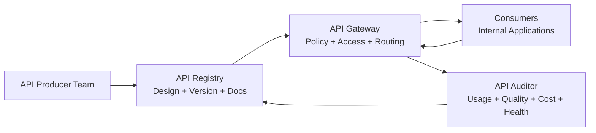
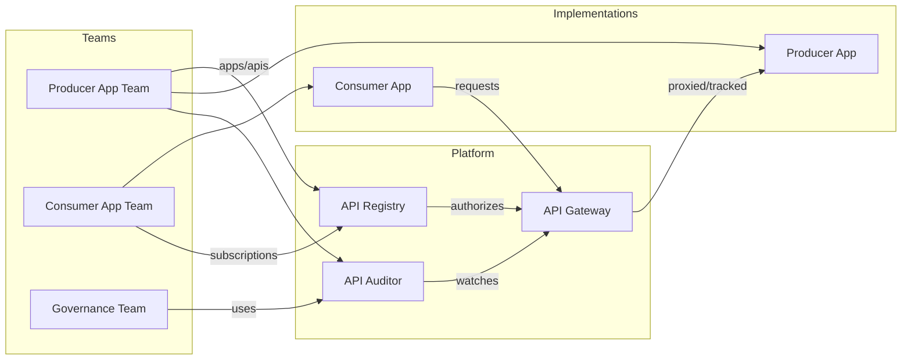
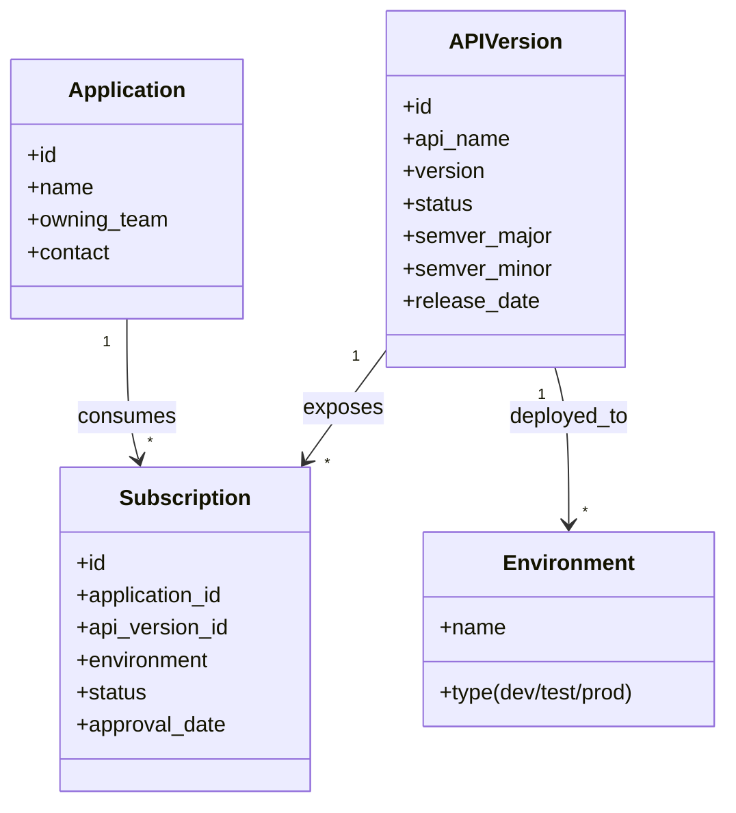
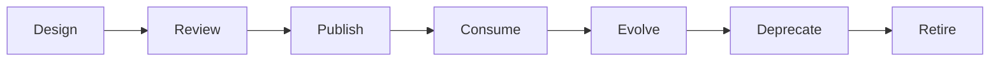
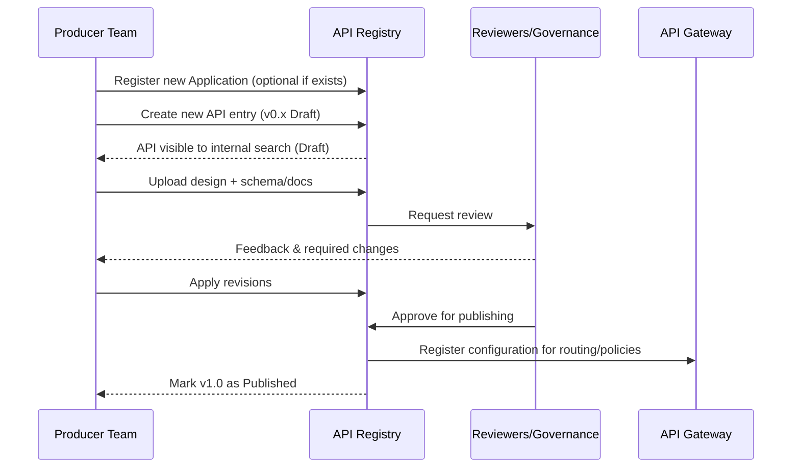
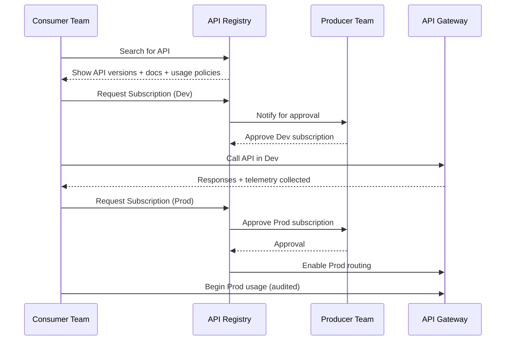
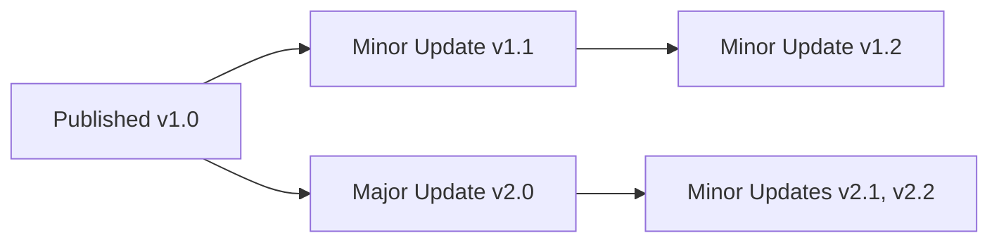

## **Scalable API Governance for Modern Engineering Organizations**

### *Executive White Paper — Treating Internal APIs as Products*

---

### **Overview**

Internal APIs now power nearly every business capability in modern digital enterprises. But while external APIs are treated as products with roadmaps, documentation, and customer experience in mind, internal APIs are often created as implementation details — poorly documented, inconsistently designed, and rarely governed. This paper proposes a modern, product-centric approach to internal API governance that improves developer experience, accelerates delivery, and reduces duplicative effort. It describes a lightweight, scalable model suitable for organizations with hundreds or thousands of internal microservices.

---

### **Executive Summary**

Enterprises with 1,000+ internal services often face an invisible tax: duplicated APIs, inconsistent design, unclear ownership, version confusion, and “shadow consumers” relying on unapproved or outdated interfaces. These issues slow delivery, create security exposure, and make modernization expensive.

**The core insight:**

> Internal APIs should be treated as products — with customers, lifecycles, quality standards, and experience expectations.

This paper introduces a unified framework for API standardization, discoverability, auditability, and lifecycle management. It emphasizes developer experience and reusability, supported by a governance model that doesn’t slow teams down.

---

### **The Current Internal API Problem**

APIs often emerge as byproducts of project work rather than deliberate products. Over time, this leads to:

* **Reinvented capabilities** because teams can’t find existing APIs
* **Inconsistent patterns** that increase cognitive load for developers
* **Version sprawl** and confusion over what’s compatible or safe to use
* **Unclear ownership** for support, questions, and breaking changes
* **Difficult deprecation** because no one knows who is still using what

These problems compound at scale. Organizations with 300+ APIs typically see entropy outpace governance unless they adopt a platform-based operating model.

---

### **Why “API as Product” Is the Required Mindset Shift**

Treating internal APIs as products transforms them from artifacts into **owned, curated, discoverable, and reliable services** that developers trust and want to use.

**A Product Mindset Means:**

| Principle                | Description                                                      |
| ------------------------ | ---------------------------------------------------------------- |
| **Clear Ownership**      | Every API has a product owner and roadmap                        |
| **Customer Experience**  | Developer usability, documentation, and consistency matter       |
| **Lifecycle Discipline** | Versioning, support, deprecation, and retirement are intentional |
| **Feedback Loops**       | Consumers can request features and report issues                 |
| **Value Orientation**    | APIs exist to create reuse, not duplication                      |

This mindset unlocks reuse — the fastest path to improving engineering velocity.

---

### **A Modern Model for Internal API Governance**

To enable API-as-product at scale, organizations need a small number of cohesive platform capabilities:

* **Standardization** of design, security, and documentation
* **Discoverability** so developers find existing APIs before building new ones
* **Auditability** to know who uses what, and how
* **Lifecycle Management**, from creation to retirement
* **Developer Experience** that encourages reuse instead of bypassing process

These pillars form a healthy internal API ecosystem.

---

### **A High-Level View of the Platform**

The following conceptual model shows how a registry, gateway, and lifecycle work together to support API-as-product.

* **Registry**: Source of truth for APIs, their versions, documentation, ownership, and consumers
* **Gateway**: Enforces access control, version rules, and gathers telemetry
* **Auditor**: Provides visibility into usage, reliability, cost, and lifecycle readiness

---

### **Lifecycle of an API Product**

A well-governed API follows an intentional lifecycle aligned to product thinking:

* **Idea → Design:** API defined early in the registry, with purpose and intended users
* **Review:** Peer and architectural feedback improves quality
* **Publish:** Approved for production use, discoverable by others
* **Adopt:** Consumers onboard with approvals and transparency
* **Evolve:** Semantic versioning (Minor = backwards compatible; Major = breaking)
* **Deprecate & Retire:** Clear process to sunset gracefully

This keeps APIs fit for purpose, safe to evolve, and easy to consume.

---

### **Developer Experience: The Differentiating Success Factor**

Good governance only works when **developers want to participate**. That requires:

* Clear, welcoming onboarding
* Excellent documentation and examples
* Consistent design standards that reduce friction
* Easy self-service discovery and subscription
* Fast approval loops

This is a “paved road, not a police force” approach — enabling productivity while guiding behavior.

A delightful internal developer experience is the best enforcement mechanism.

---

### **Benefits of Adopting This Model**

Organizations that adopt API-as-product governance see measurable impact:

| Outcome                              | Benefit                                                        |
| ------------------------------------ | -------------------------------------------------------------- |
| **Higher Velocity**                  | Faster delivery by reusing existing APIs instead of rebuilding |
| **Improved Quality**                 | Standardized design and consistent expectations                |
| **Reduced Cost**                     | Less duplication, less maintenance, fewer outages              |
| **Better Risk & Compliance Posture** | Know who depends on what, and why                              |
| **Intentional Modernization**        | Easier migration and deprecation                               |

These gains compound as adoption grows.

---

### **A Practical Transformation Roadmap**

This approach does not require a “big bang” transformation. A phased rollout works best:

| Phase                | Focus                                             | Result                             |
| -------------------- | ------------------------------------------------- | ---------------------------------- |
| **1 — Visibility**   | Establish registry, owners, basic lifecycle       | Everyone sees what exists          |
| **2 — Guardrails**   | Introduce standards, version policies, approvals  | Consistency and confidence improve |
| **3 — Enforcement**  | Gateway-required access, subscription-based usage | Self-service and safe-by-default   |
| **4 — Optimization** | Metrics, cost attribution, AI-assisted review     | Data-driven continuous improvement |

This evolution typically spans 12–24 months in large enterprises.

---

### **Why a Unified Platform Beats Fragmented Tools**

Some companies attempt to build this piecemeal — a wiki catalog here, a gateway policy there, a spreadsheet for lifecycle tracking. This rarely works at scale because:

* Tools aren’t integrated
* Data can’t be trusted
* Ownership is unclear
* Developers bypass painful processes

A unified platform provides:

* One source of truth
* Seamless producer and consumer experience
* Automated compliance
* Consistent governance with minimal friction

This paper is intentionally platform-agnostic, but the pattern strongly favors integrated solutions over scattered tools.

---

### **Conclusion**

Internal APIs are one of the most valuable assets in a modern digital enterprise — but only when treated as **products**, not output artifacts of projects. A product mindset, paired with light but effective governance, creates a thriving ecosystem where teams move quickly, reuse grows naturally, and systems evolve safely.

This approach empowers developers, improves platform ROI, and reduces long-term complexity. The organizations that adopt it now will be positioned to innovate faster as the next wave of automation, AI-driven development, and platform engineering accelerates.

---

If you'd like, I can now generate **Document 2: Technical Appendix** in Markdown with more diagrams, data models, and lifecycle sequences.

Would you like that **now** or **after any edits to this Executive draft**?

# Technical Appendix: API Governance & Platform Model

## 1. Introduction

This appendix provides the architecture, data structures, lifecycle flows, and governance practices that enable an API-as-Product operating model. It is platform-agnostic and focuses on concepts required to support scalable internal API ecosystems (300–5,000+ services).

It is intended for:
- Principal engineers and architects
- Platform engineering and developer experience teams
- API product owners and governance leads

---

## 2. Reference Architecture Overview

The architecture below shows the core platform components that enable discoverability, controlled consumption, and measurable API product quality.

### Component Purposes

| Component | Responsibilities |
|-----------|------------------|
| **API Registry** | System of record: API definitions, versions, docs, ownership, subscriptions, lifecycle state |
| **API Gateway** | Enforces access, version rules, routing, policy; captures call metadata |
| **API Auditor** | Usage analytics, reliability metrics, cost attribution, consumer impact, deprecation readiness |

This architecture ensures APIs are intentionally designed, discoverable, governed, and measurable.

---

## 3. Core Data Model

The following entities form the foundation for API tracking, lifecycle management, and usage relationships.

### Entity Descriptions

**Application**  
Represents an internally registered software system capable of producing or consuming APIs.

**API Version**  
A specific version of an API, governed by semantic versioning. Carries state (e.g., Draft, Published, Deprecated, Retired).

**Environment**  
Deployment target of an API version; typically dev, test, prod.

**Subscription**  
A formal relationship confirming a specific Application is approved to consume a particular API Version in a given Environment.

---

## 4. API Lifecycle Overview

The lifecycle supports producer workflow, consumer onboarding, iteration, and responsible deprecation.

Lifecycle states map directly to governance and policy enforcement points.

## 5. Producer & Consumer Lifecycle in Detail

This section expands lifecycle stages into actionable workflows for both API producers and consumers.

### 5.1 Producer Workflow (API Creation → Publication)

**Key Concepts:**
- Draft versions allow early visibility
- Reviews focus on quality, consistency, security, naming, domain alignment
- Once published, API is contractually “live” as a product

---

### 5.2 Consumer Workflow (Discovery → Permissioned Use)

**Principles:**
- Producers always approve consumers (Dev + Prod)
- Gateway enforces subscription validity
- No “drive-by” API usage; every consumer is known

---

## 6. API Versioning & Evolution

Semantic Versioning (SemVer) applies to API evolution:

| Version Type | Example | Breaking? | Notes |
|--------------|----------|------------|--------|
| **Major** | 2.0 → 3.0 | Yes | Backward incompatible; treated as new product line |
| **Minor** | 2.1 → 2.2 | No | Backward compatible enhancements |
| **Patch*** | 2.1.1 → 2.1.2 | No | Fixes only (optional to track) |

\* Some orgs omit Patch and treat Minor as the smallest increment.

### Rules of Evolution
- **Major versions run in parallel** until deprecation
- **Consumers self-elect to upgrade** (no forced breakage)
- **Enhancements go into Minor versions** unless breaking

---

### 6.1 Version Evolution Flow

**Policy Recommendations:**
- Limit concurrent Major versions (e.g., only 2 active at once)
- Require deprecation plan when publishing a new Major

---

## 7. Deprecation & Retirement

APIs should sunset safely with full visibility of consumer impact.

### 7.1 Deprecation to Retirement Flow

**Definition of Stages:**

| Stage | Rules |
|--------|--------|
| **Deprecated** | No new subscriptions; communicated to consumers; migration path must exist |
| **Eligible for Retirement** | Minimum deprecation window elapsed; >0 consumers allowed but must be migrated |
| **Retired** | Fully disabled for use; metadata retained |

**Telemetry Requirements to Retire:**
- Identify all consumers + traffic volume
- Verify no non-human/system scripts are still calling the API

---

## 8. E2E Consumer Impact Visibility

To responsibly deprecate, producers need clear consumer insight:

- Active vs inactive consumers
- Version-by-version adoption
- Top endpoints and call volumes
- Error clusters by consumer
- Support tickets or feedback history

The **Auditor** provides this automatically, enabling confident sunsets.

## 9. Governance Policies & Standards

This model aims for **lightweight, automation-first governance** that improves consistency without slowing teams.

### 9.1 Governance Principles

| Principle | Description |
|-----------|----------------|
| **Nudge > Police** | Defaults, tooling, and templates encourage desired behavior |
| **Shift Left** | Quality and consistency checks integrated into design and CI |
| **Transparency** | All APIs, versions, consumers, and owners are visible |
| **Product Ownership** | APIs have roadmaps, lifecycle plans, and feedback channels |
| **Evidence-Based Decisions** | Auditor metrics inform reviews and sunsets |

### 9.2 API Review Criteria

Reviews check for:

- Functional clarity and business alignment
- Naming consistency and domain ownership
- Security patterns (authn/authz, PII handling, rate limits)
- Data model and error model standards
- Versioning and change impact assessment
- Documentation completeness (developer onboarding ready)

**Automation Opportunities:**  
Linting schema, naming, version compatibility, and documentation completeness can be tool-enforced before human review.

---

## 10. Integration with SDLC & Developer Workflows

### 10.1 Where API Governance Fits in the SDLC

| SDLC Stage | API Governance Touchpoint |
|-------------|-----------------------------|
| **Ideation** | API registered early for visibility |
| **Design** | Standards, templates, automated linting |
| **Build** | Mock/testing environments via Gateway |
| **Test** | Compatibility testing across versions |
| **Release** | Registry + Gateway publish action |
| **Operate** | Auditor monitors performance & usage |
| **Evolve** | Roadmap + feedback-driven improvements |
| **Sunset** | Deprecation policy & consumer support |

### 10.2 Tooling Integrations

- **CI/CD:** Auto-publish API metadata, run design linters, update Registry
- **Git Hooks:** Prevent breaking change merges without major version bump
- **Developer Portal:** One-stop shop for search, docs, samples, onboarding
- **Support & Feedback:** Feedback loop integrated into Registry
- **Alerting:** Continuous evaluation notes atypical usage, errors in situ, and cost visibility

---

## 11. KPIs & Maturity Model

### 11.1 Key Performance Indicators

| Category | Metric | Target Behavior |
|-----------|---------|------------------|
| **Reuse** | % of new features using existing APIs | Rising over time |
| **Quality** | API error rate & latency SLO adherence | Healthy, monitored |
| **DX** | Time to first successful call | < 20 minutes from discovery |
| **Lifecycle Health** | Ratio of Deprecated:Active APIs | Low deprecated backlog |
| **Governance** | % API changes using correct versioning | High semver compliance |
| **Sunset Discipline** | Avg. time from deprecation → retirement | Predictable, < policy max |

### 11.2 Maturity Stages

| Stage | Characteristics |
|--------|------------------|
| **Level 1 – Chaos** | Ad hoc APIs, unknown consumers, no lifecycle |
| **Level 2 – Cataloging** | Registry exists; ownership visible |
| **Level 3 – Governed** | Reviews + standards; gateway enforcement |
| **Level 4 – Product Mindset** | APIs treated as products with roadmap + feedback |
| **Level 5 – Optimized Ecosystem** | Automated policy, data-driven evolution, high reuse |

Most large orgs sit between **2 and 3** when they realize change is needed.

---

## 12. Operating Model & Roles

To run API-as-Product effectively, roles must be clear but lightweight.

| Role | Responsibilities |
|--------|--------------------|
| **API Product Owner** | Owns API roadmap, quality, docs, lifecycle, consumer relationships |
| **Producer Team** | Designs, builds, tests, operates API; handles support |
| **Consumer Team** | Requests access, provides feedback, manages integration |
| **Platform Engineering** | Builds and runs Registry, Gateway, Auditor, Dev Portal |
| **Governance Group (Small)** | Approves standards, resolves domain disputes, reviews exceptions |

**Important:** Governance is **not** a committee that reviews every change — it defines policy and automation; product owners apply it.

---

## 13. Security & Compliance Considerations

Even internal APIs need disciplined security, especially in regulated environments.

### 13.1 Core Requirements

- **AuthN & AuthZ:** Strong identity and access control via Gateway
- **Least Privilege:** Subscription limits only to needed environments & scopes
- **Audit Trail:** All calls traceable to app and owning team
- **Data Classification:** APIs declare sensitivity level; controls enforced accordingly
- **PII & Regulated Data:** Policies for logging, masking, retention, cross-border access

### 13.2 Additional Safeguards for Large Enterprises

- **Third-party access policies** if APIs exposed beyond core org
- **Dependency mapping** for risk & blast radius analysis
- **Security review automation** (linting specs for prohibited patterns)

---

    