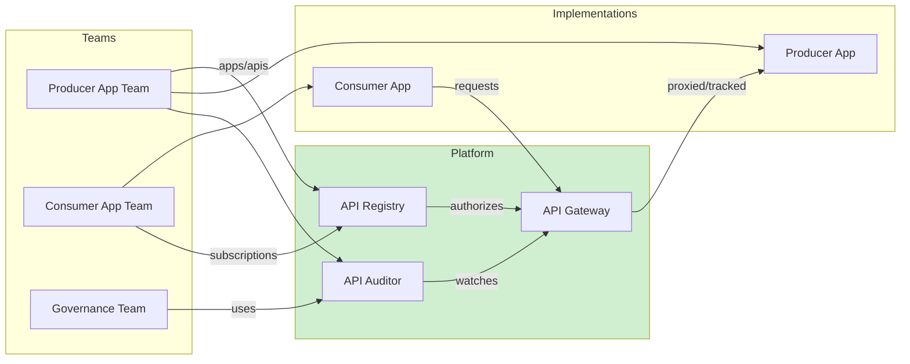
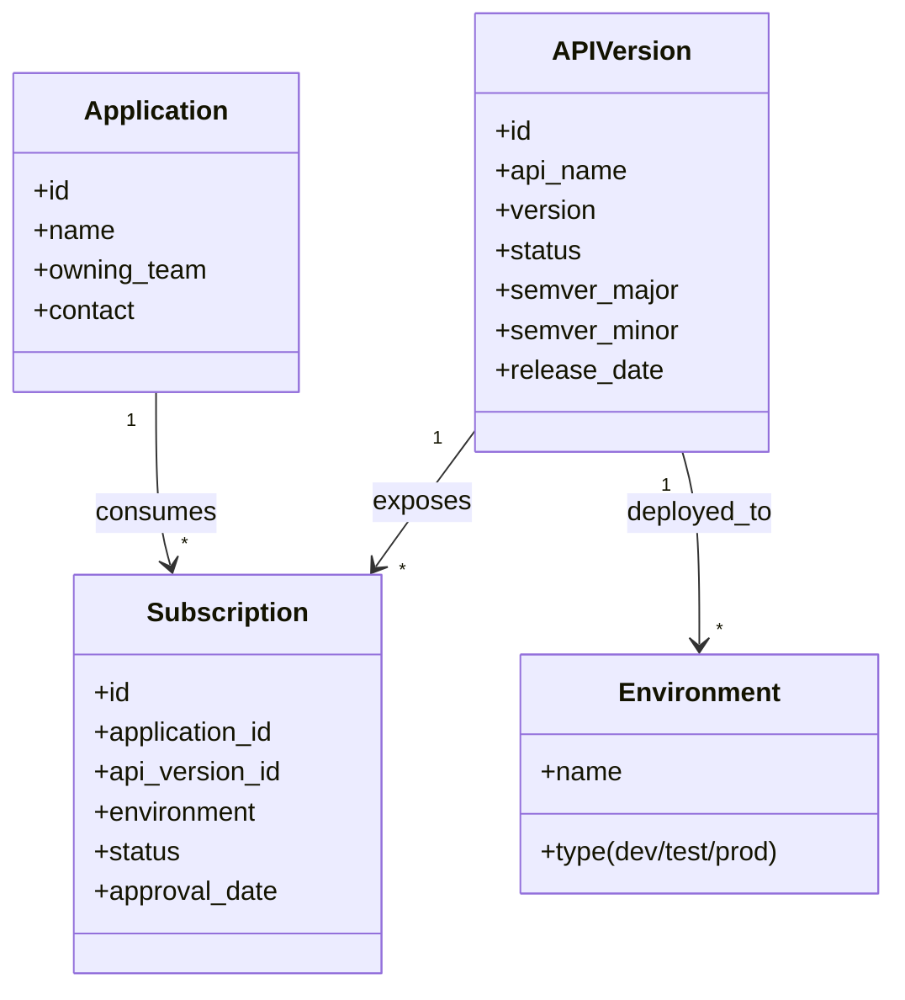
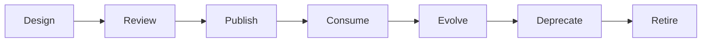
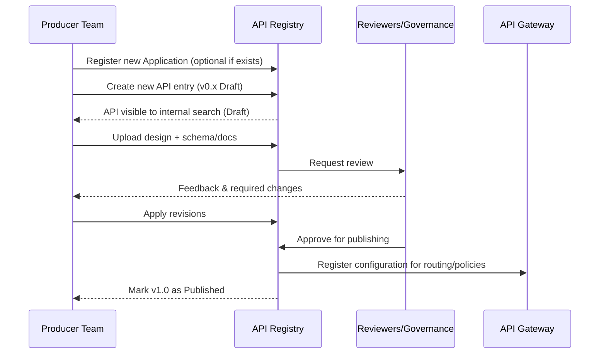
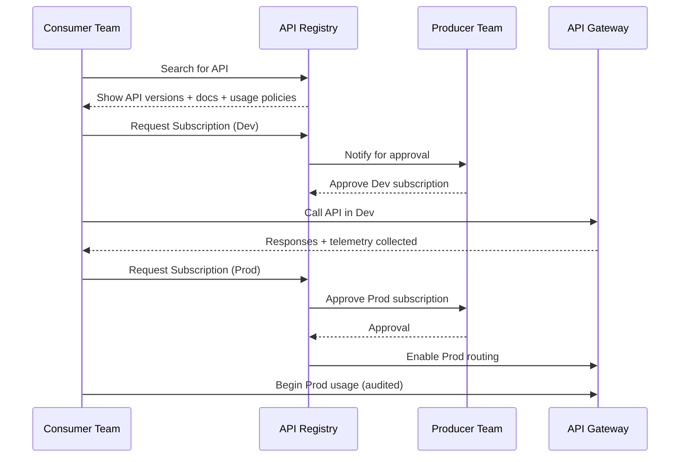
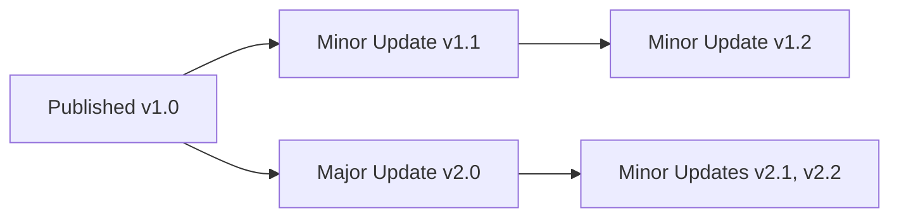
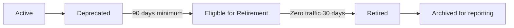

For the executive overview, [go here](README.md)

# Technical Appendix: API Governance & Platform Model

## 1. Introduction

This appendix provides the architecture, data structures, lifecycle flows, and governance practices that enable an API-as-Product operating model. It is platform-agnostic and focuses on concepts required to support scalable internal API ecosystems (300–5,000+ services).

It is intended for:
- Principal engineers and architects
- Platform engineering and developer experience teams
- API product owners and governance leads

---

## 2. Reference Architecture Overview

The architecture below shows the core platform components that enable discoverability, controlled consumption, and measurable API product quality.

### Component Purposes

| Component | Responsibilities |
|-----------|------------------|
| **API Registry** | System of record: API definitions, versions, docs, ownership, subscriptions, lifecycle state |
| **API Gateway** | Enforces access, version rules, routing, policy; captures call metadata |
| **API Auditor** | Usage analytics, reliability metrics, cost attribution, consumer impact, deprecation readiness |

This architecture ensures APIs are intentionally designed, discoverable, governed, and measurable.

---

## 3. Core Data Model

The following entities form the foundation for API tracking, lifecycle management, and usage relationships.

### Entity Descriptions

**Application**  
Represents an internally registered software system capable of producing or consuming APIs.

**API Version**  
A specific version of an API, governed by semantic versioning. Carries state (e.g., Draft, Published, Deprecated, Retired).

**Environment**  
Deployment target of an API version; typically dev, test, prod.

**Subscription**  
A formal relationship confirming a specific Application is approved to consume a particular API Version in a given Environment.

---

## 4. API Lifecycle Overview

The lifecycle supports producer workflow, consumer onboarding, iteration, and responsible deprecation.

Lifecycle states map directly to governance and policy enforcement points.

## 5. Producer & Consumer Lifecycle in Detail

This section expands lifecycle stages into actionable workflows for both API producers and consumers.

### 5.1 Producer Workflow (API Creation → Publication)

**Key Concepts:**
- Draft versions allow early visibility
- Reviews focus on quality, consistency, security, naming, domain alignment
- Once published, API is contractually “live” as a product

---

### 5.2 Consumer Workflow (Discovery → Permissioned Use)

**Principles:**
- Producers always approve consumers (Dev + Prod)
- Gateway enforces subscription validity
- No “drive-by” API usage; every consumer is known

---

## 6. API Versioning & Evolution

Semantic Versioning (SemVer) applies to API evolution:

| Version Type | Example | Breaking? | Notes |
|--------------|----------|------------|--------|
| **Major** | 2.0 → 3.0 | Yes | Backward incompatible; treated as new product line |
| **Minor** | 2.1 → 2.2 | No | Backward compatible enhancements |
| **Patch*** | 2.1.1 → 2.1.2 | No | Fixes only (optional to track) |

\* Some orgs omit Patch and treat Minor as the smallest increment.

### Rules of Evolution
- **Major versions run in parallel** until deprecation
- **Consumers self-elect to upgrade** (no forced breakage)
- **Enhancements go into Minor versions** unless breaking

---

### 6.1 Version Evolution Flow

**Policy Recommendations:**
- Limit concurrent Major versions (e.g., only 2 active at once)
- Require deprecation plan when publishing a new Major

---

## 7. Deprecation & Retirement

APIs should sunset safely with full visibility of consumer impact.

### 7.1 Deprecation to Retirement Flow

**Definition of Stages:**

| Stage | Rules |
|--------|--------|
| **Deprecated** | No new subscriptions; communicated to consumers; migration path must exist |
| **Eligible for Retirement** | Minimum deprecation window elapsed; >0 consumers allowed but must be migrated |
| **Retired** | Fully disabled for use; metadata retained |

**Telemetry Requirements to Retire:**
- Identify all consumers + traffic volume
- Verify no non-human/system scripts are still calling the API

---

## 8. E2E Consumer Impact Visibility

To responsibly deprecate, producers need clear consumer insight:

- Active vs inactive consumers
- Version-by-version adoption
- Top endpoints and call volumes
- Error clusters by consumer
- Support tickets or feedback history

The **Auditor** provides this automatically, enabling confident sunsets.

## 9. Governance Policies & Standards

This model aims for **lightweight, automation-first governance** that improves consistency without slowing teams.

### 9.1 Governance Principles

| Principle | Description |
|-----------|----------------|
| **Nudge > Police** | Defaults, tooling, and templates encourage desired behavior |
| **Shift Left** | Quality and consistency checks integrated into design and CI |
| **Transparency** | All APIs, versions, consumers, and owners are visible |
| **Product Ownership** | APIs have roadmaps, lifecycle plans, and feedback channels |
| **Evidence-Based Decisions** | Auditor metrics inform reviews and sunsets |

### 9.2 API Review Criteria

Reviews check for:

- Functional clarity and business alignment
- Naming consistency and domain ownership
- Security patterns (authn/authz, PII handling, rate limits)
- Data model and error model standards
- Versioning and change impact assessment
- Documentation completeness (developer onboarding ready)

**Automation Opportunities:**  
Linting schema, naming, version compatibility, and documentation completeness can be tool-enforced before human review.

---

## 10. Integration with SDLC & Developer Workflows

### 10.1 Where API Governance Fits in the SDLC

| SDLC Stage | API Governance Touchpoint |
|-------------|-----------------------------|
| **Ideation** | API registered early for visibility |
| **Design** | Standards, templates, automated linting |
| **Build** | Mock/testing environments via Gateway |
| **Test** | Compatibility testing across versions |
| **Release** | Registry + Gateway publish action |
| **Operate** | Auditor monitors performance & usage |
| **Evolve** | Roadmap + feedback-driven improvements |
| **Sunset** | Deprecation policy & consumer support |

### 10.2 Tooling Integrations

- **CI/CD:** Auto-publish API metadata, run design linters, update Registry
- **Git Hooks:** Prevent breaking change merges without major version bump
- **Developer Portal:** One-stop shop for search, docs, samples, onboarding
- **Support & Feedback:** Feedback loop integrated into Registry
- **Alerting:** Continuous evaluation notes atypical usage, errors in situ, and cost visibility

---

## 11. KPIs & Maturity Model

### 11.1 Key Performance Indicators

| Category | Metric | Target Behavior |
|-----------|---------|------------------|
| **Reuse** | % of new features using existing APIs | Rising over time |
| **Quality** | API error rate & latency SLO adherence | Healthy, monitored |
| **DX** | Time to first successful call | < 20 minutes from discovery |
| **Lifecycle Health** | Ratio of Deprecated:Active APIs | Low deprecated backlog |
| **Governance** | % API changes using correct versioning | High semver compliance |
| **Sunset Discipline** | Avg. time from deprecation → retirement | Predictable, < policy max |

### 11.2 Maturity Stages

| Stage | Characteristics |
|--------|------------------|
| **Level 1 – Chaos** | Ad hoc APIs, unknown consumers, no lifecycle |
| **Level 2 – Cataloging** | Registry exists; ownership visible |
| **Level 3 – Governed** | Reviews + standards; gateway enforcement |
| **Level 4 – Product Mindset** | APIs treated as products with roadmap + feedback |
| **Level 5 – Optimized Ecosystem** | Automated policy, data-driven evolution, high reuse |

Most large orgs sit between **2 and 3** when they realize change is needed.

---

## 12. Operating Model & Roles

To run API-as-Product effectively, roles must be clear but lightweight.

| Role | Responsibilities |
|--------|--------------------|
| **API Product Owner** | Owns API roadmap, quality, docs, lifecycle, consumer relationships |
| **Producer Team** | Designs, builds, tests, operates API; handles support |
| **Consumer Team** | Requests access, provides feedback, manages integration |
| **Platform Engineering** | Builds and runs Registry, Gateway, Auditor, Dev Portal |
| **Governance Group (Small)** | Approves standards, resolves domain disputes, reviews exceptions |

**Important:** Governance is **not** a committee that reviews every change — it defines policy and automation; product owners apply it.

---

## 13. Security & Compliance Considerations

Even internal APIs need disciplined security, especially in regulated environments.

### 13.1 Core Requirements

- **AuthN & AuthZ:** Strong identity and access control via Gateway
- **Least Privilege:** Subscription limits only to needed environments & scopes
- **Audit Trail:** All calls traceable to app and owning team
- **Data Classification:** APIs declare sensitivity level; controls enforced accordingly
- **PII & Regulated Data:** Policies for logging, masking, retention, cross-border access

### 13.2 Additional Safeguards for Large Enterprises

- **Third-party access policies** if APIs exposed beyond core org
- **Dependency mapping** for risk & blast radius analysis
- **Security review automation** (linting specs for prohibited patterns)

---

    
